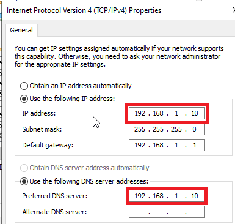
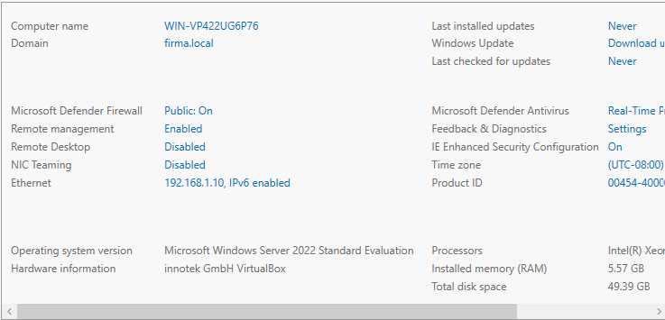
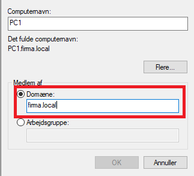
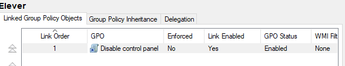
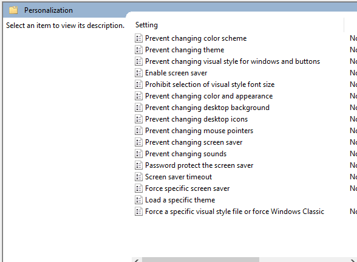
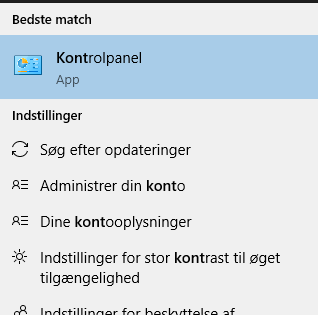
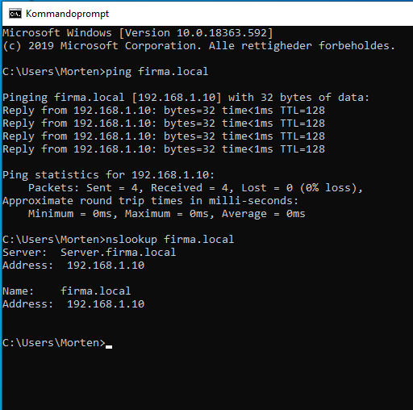
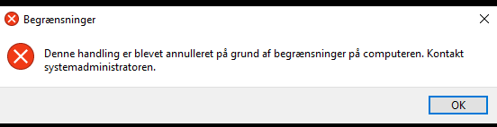

# 🧑‍💻 IT Infrastructure & Systems Engineering Portfolio
**Candidate:** Ramakant Joshi  
**Location:** Copenhagen, Denmark  
**Education:** Technical Education Copenhagen (TEC)  

---

## 📂 Portfolio Overview
This portfolio contains documented engineering labs demonstrating my hands-on capabilities in **Systems Administration (Windows Server 2022)** and **Network Engineering (Cisco)**. All environments were designed, configured, and verified by me to simulate real-world enterprise architectures.

### 📌 Project Master File
* 📑 **Download Full Project Report (PDF):** [Portfolio OS.pdf](Portfolio OS.pdf)

---

## 🛠️ Project 1: Enterprise Active Directory & Group Policy Deployment

### 📋 Project Overview
* **Objective:** Design, deploy, and secure a centralized Windows Domain environment using VirtualBox to simulate a corporate infrastructure.
* **Core Technologies:** Windows Server 2022 Standard, Active Directory Domain Services (AD DS), DNS, DHCP, and Group Policy Management.
* **Environment Parameters:** Domain: `firma.local` | DC Hostname: `SRV-01` | Network: `192.168.1.0/24`

### ⚙️ Implementation Details
1. **Network Baseline:** Configured Domain Controller with a static IP (`192.168.1.10`). Configured workstation `PC1` to use the server as its preferred DNS to successfully bind the client to the `firma.local` tree.
2. **Directory Identity Structure:** Deployed Active Directory Domain Services. Built a dedicated Organizational Unit (OU) named `Elever` to segregate restricted user profiles from core staff.
3. **Security Hardening (GPO):** Created and enforced a Group Policy Object (GPO) titled `Disable control panel`. Tied this rule to the `Elever` OU to restrict access to the control panel subsystem.

### 🔍 Verification & Diagnostics
* **Network Connectivity:** Executed bidirectional `ping` sweeps between host and guest environments to verify Layer 3 connectivity.
* **Service Availability Check:** Validated that crucial authentication and name resolution ports were online using command line telnet mapping:
  ```cmd
  telnet firma.local 53
  ```

<details>
<summary><b>📸 Click here to view Project Screenshots & Configuration Proofs</b></summary>

| Static IP Configuration | Domain Name Details |
| :---: | :---: |
|  |  |

| Client Domain Association | GPO Management View |
| :---: | :---: |
|  |  |

| GPO Status Verification | GPO Deployment on Client |
| :---: | :---: |
|  |  |

| Network Diagnostics View | GPO Block Execution Proof |
| :---: | :---: |
|  |  |

</details>

---

## 🛠️ Project 2: Workstation Security Hardening & Disaster Recovery

### 📋 Project Overview
* **Objective:** Configure, secure, and automate maintenance workflows for corporate Windows workstations within a virtualized enterprise staging environment.
* **Core Technologies:** Windows Task Scheduler (Opgavestyring), Windows Defender Firewall, AOMEI Backupper Standard, Avast Antivirus, Windows System Restore (Systemgendannelse).

### ⚙️ Implementation & Maintenance Details
1. **Automated Data Redundancy:** 
   * Engineered automated daily backup routines (`Dagligbackup`) using **Task Scheduler (Opgavestyring)** to trigger localized file extraction processes automatically at 13:00.
   * Deployed **AOMEI Backupper Standard** to manage system-state partition images (`Min Fil Backup`), establishing robust backup histories.
2. **Workstation Optimization & Threat Mitigation:**
   * Installed **Avast Free Antivirus** to secure the local endpoints, ensuring full real-time file shielding and registry monitoring.
3. **Identity & Firewall Architecture:**
   * Structured local user security profiles based on department routing (e.g., `Bavranjan Gupta - IT Chef`, `Charlie Mørk - Ledelse`).
   * Configured explicit **Windows Defender Firewall** inbound rules, specifically enabling ICMPv4 protocols to support secure internal network diagnostics.

### 🔍 Technical Troubleshooting Case Study: APIPA Resolution
* **The Issue:** Workstations `PC1` and `PC2` suddenly experienced total loss of network resource accessibility.
* **The Diagnosis:** Detected a fallback IP allocation within the **`169.254.X.X` subnet range** via `ipconfig`. This directly isolated the root cause: an **APIPA (Automatic Private IP Addressing)** state, proving the clients completely lost operational links to the DHCP server.
* **The Recovery:** Leveraged **System Restore (Systemgendannelse)** points to roll back broken configuration boundaries, safely restoring workstation connectivity.
